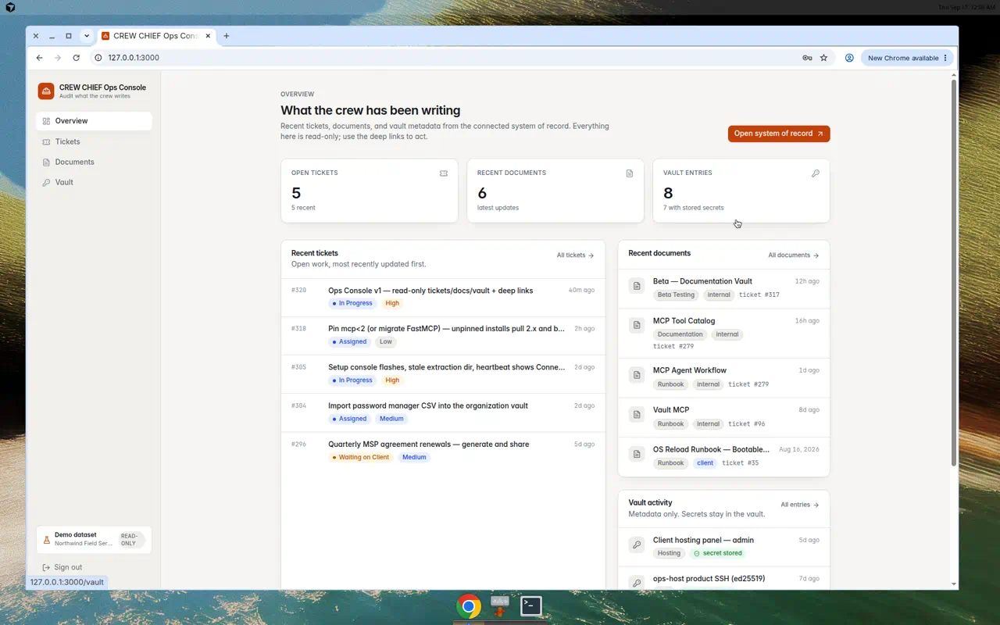

# CREW CHIEF Ops Console

The human, read-only window for a **CREW CHIEF** crew: the tickets it works,
the notes and documents it writes, and the credential metadata it files, with
deep links into whatever system of record the crew uses.

This repository is the **public template** for that console. It ships with a
fictional demo dataset, no credentials, and no company branding. Reads go
through the `SystemOfRecord` interface; the built-in fixtures are the default
adapter. Any MCP server or read API can plug in behind that interface. It is
the UI companion to [`crew-chief-middleware`](https://github.com/TechHandPro/crew-chief-middleware),
which turns an OpenAPI spec into an MCP server and stays CLI/MCP-only.

The console never creates, edits, or reveals anything. It reads through the
same MCP endpoint the crew's agents use (when you connect one) and hands you
off to the real system when you need to act.

Public pack (this repo, fixtures, generic defaults) versus a private deploy
is documented in [docs/public-pack.md](docs/public-pack.md). Live hostnames
and secrets are env-only; they are never required defaults.

<p>
  
</p>

## What it shows

| Area | List | Detail | Deep link |
|------|------|--------|-----------|
| Tickets | search, open/all toggle, status & priority badges | Markdown description, comment history, linked docs and vault entries | `SOR_TICKET_URL_TEMPLATE` |
| Documents | search, category chips, per-ticket filter | rendered Markdown (HTML skipped), front-matter panel | `SOR_DOCUMENT_URL_TEMPLATE` |
| Vault | search, category chips, has-secret / OTP indicators | metadata, notes, linked tickets/contact/asset/domain/network | `SOR_VAULT_URL_TEMPLATE` |

Vault views are **metadata only** by construction: the interface has no
method that returns a secret, adapters have no code path to a reveal tool,
and the console refuses to render a vault payload that unexpectedly contains
a `password`/`secret` field.

## Try it in two minutes (no credentials)

Requires Node 22+.

```bash
npm install
npm run dev              # http://localhost:3000, demo dataset, no sign-in
```

Without any environment the console runs against the fictional dataset in
`src/lib/sor/fixtures/` so anyone can evaluate the UI. The connection badge
says so, and every deep link points at `https://sor.example`. To ship the demo
as a production build (for a contest entry or a hosted preview) set
`SOR_PROVIDER=fixtures` explicitly plus the access variables below.

## The `SystemOfRecord` interface

The console talks to one adapter, chosen by `SOR_PROVIDER`:

| `SOR_PROVIDER` | Reads from | Credentials | Where |
|----------------|------------|-------------|-------|
| `fixtures` (default) | built-in demo dataset | none | `src/lib/sor/fixtures/` |
| *yours* | any MCP server or read API | whatever it needs | `src/lib/sor/<name>/` |

`src/lib/sor/provider.ts` defines the read-only `SystemOfRecord` interface
(`listTickets`, `getTicket`, `listDocuments`, `getDocument`,
`listVaultEntries`, `getVaultEntry`, `getConnection`, plus a `links` object
for deep links). Adding an adapter is five contained steps:

1. **Implement the interface** in `src/lib/sor/<name>/provider.ts`, mapping
   your wire format into the types in `src/lib/sor/types.ts`. The UI only
   ever sees those types. Build `links` with `createDeepLinks` so records can
   hand off to your web UI.
2. **Parse configuration** in `src/lib/config.ts`: add `"<name>"` to
   `ProviderKind`, read the environment your adapter needs, and fail closed
   when a secret is missing.
3. **Register it** in `createSystemOfRecord` (`src/lib/sor/index.ts`). The
   `switch` is exhaustive, so `npm run typecheck` lists every place that
   needs the new case.
4. **Keep the guarantees.** Allow-list the tools your adapter may call, reject
   payloads carrying secret material, and throw `SystemOfRecordError` with
   one of its kinds (`unreachable`, `unauthorized`, `forbidden`,
   `bad_response`, `upstream`) so the shared error states can explain what
   happened.
5. **Test the adapter.** Spin up a fake server that speaks the target's
   shapes (Streamable HTTP is the usual MCP transport) and drive the real
   client through auth, routing, parsing, session loss, and the
   never-call-reveal guarantee.

If your server was generated by `crew-chief-middleware`, reuse a Streamable
HTTP + Bearer MCP client; only the tool names and schemas change.

### Optional: connect a live MCP server

A live system of record is **not required**. When you have one, point an
adapter at it with that adapter's own environment. The shape is always the
same — provider name, a badge label, a URL, a key, a tenant pin:

```bash
cp .env.example .env.local
# SOR_PROVIDER=<your-adapter>
# SOR_SYSTEM_NAME=Your system of record
# <ADAPTER>_MCP_URL=https://sor.example/mcp
# <ADAPTER>_WEB_BASE_URL=https://sor.example
# <ADAPTER>_MCP_API_KEY=…
# <ADAPTER>_ORGANIZATION_ID=…
npm run dev
```

The key lives only in the server process environment. It is never sent to the
browser, never logged, and never part of an error message. One in-tree MCP
client is documented as an optional reference in
[docs/public-pack.md](docs/public-pack.md#appendix-optional-reference) — skip
it unless you are plugging that specific server in.

## Branding

Defaults are the generic template: **CREW CHIEF Ops Console** / *Audit what
the crew writes*. A deployment re-labels itself through environment only:

| Variable | Default | Shown |
|----------|---------|-------|
| `OPS_CONSOLE_BRAND_NAME` | `CREW CHIEF Ops Console` | shell, sign-in, document titles |
| `OPS_CONSOLE_BRAND_TAGLINE` | `Audit what the crew writes` | shell, sign-in |
| `SOR_SYSTEM_NAME` | the adapter's own name | connection badge |

There are no company names in the UI code or the demo dataset. A private
deploy (hostname, branding, live adapter URL) is configured entirely through
those variables plus the adapter env; this repository never requires a
private hostname. See [Public pack vs dogfood](docs/public-pack.md) for the
split and the deny-list (no vault secrets/paths, no client names, no private
hostnames as required defaults).

## Console access

The console exposes ticket contents and credential metadata, so it ships
**fail-closed**:

- In production `OPS_CONSOLE_ACCESS_TOKEN` and `OPS_CONSOLE_SESSION_SECRET`
  are required. Missing either returns HTTP 503 with the exact variable name.
- Operators enter the access token once; a signed (HMAC-SHA256), HttpOnly,
  `SameSite=Lax`, `Secure` cookie carries the session for
  `OPS_CONSOLE_SESSION_TTL_HOURS` (default 12).
- Token comparison is constant-time; five failed attempts from one address
  block that address for 15 minutes.
- `proxy.ts` redirects unauthenticated requests (including router prefetches)
  to `/sign-in`, and every page re-checks the session server-side.
- Set `OPS_CONSOLE_ALLOW_ANONYMOUS=true` only when an identity-aware proxy
  (Cloudflare Access, Tailscale, oauth2-proxy…) already gates the hostname.

Every response carries a nonce-based CSP with `frame-ancestors 'none'`,
`X-Content-Type-Options: nosniff`, `Referrer-Policy: no-referrer`, HSTS, and
`Cache-Control: no-store`. Markdown bodies render with HTML skipped, only
`http(s)`/`mailto` links, and remote images replaced by their alt text.

## Deploy

Portable seating is the **Deploy Ops Console** skill:
[`docs/DEPLOY_OPS_CONSOLE.md`](docs/DEPLOY_OPS_CONSOLE.md). **Do not default
to WSL2.** Tracks: (A) Docker Desktop on Windows + localhost port; (B)
optional per-machine hosts → `ops.local`; (C) later VPS+Caddy+public DNS (a
private hostname is env-only and is not required here). Secrets stay out of
chat.

This is a standalone web app; it does not deploy with any system of record.

**Container**

```bash
docker build -t crew-chief-ops-console .
docker run --rm -p 3000:3000 \
  -e SOR_PROVIDER=fixtures \
  -e OPS_CONSOLE_ACCESS_TOKEN=… -e OPS_CONSOLE_SESSION_SECRET=… \
  crew-chief-ops-console
```

The image is `output: "standalone"`, runs as a non-root user, and exposes
`GET /api/health` (reports config validity and active provider; it does not
call the system of record, so an upstream outage does not flap the console's
own health). To attach a live system of record, set `SOR_PROVIDER` to your
adapter and pass that adapter's URL, key, and tenant pin. There is no default
hostname.

**Node host / systemd**

```bash
npm ci && npm run build
PORT=3000 node .next/standalone/server.js     # with the env above exported
```

Put it behind TLS (Caddy/nginx). The MCP endpoint must be reachable from the
host running the console; the browser never talks to the system of record.

**Vercel / similar**: works as-is; set the same environment variables as
server-side secrets. Note the in-process read cache and sign-in limiter are
per instance.

## Development

```
src/
  app/                   routes (App Router). (console)/ is gated; sign-in is public
  components/            UI primitives, record rows, shell, markdown renderer
  lib/config.ts          zod-validated environment, fail-closed rules, branding
  lib/auth/              session tokens, access helpers, failure limiter
  lib/sor/               SystemOfRecord contract, deep links, memo cache
  lib/sor/fixtures/      demo dataset adapter (default; fictional 9000–9999 ids)
  proxy.ts               auth redirect + security headers
docs/public-pack.md           public pack vs dogfood + deny-list
docs/DEPLOY_OPS_CONSOLE.md    deploy skill: Desktop+localhost, optional ops.local, later VPS (not WSL2)
```

Scripts: `npm run dev`, `npm run build`, `npm start`, `npm test`,
`npm run lint`, `npm run typecheck`.

`npm test` runs unit tests for config, schemas, sessions, and formatting,
adapter integration tests, and the public-pack deny-list check
(`src/lib/public-pack.denylist.test.ts`), including README prose so a vendor
system of record cannot read as required.

## Not in scope

- Creating or editing tickets, documents, or vault entries
- Revealing secrets
- Replacing the middleware with a UI
- Browser automation as a data path
